# LangGraph Game Engine Dependencies Graph

## Overview

This document provides a visual representation of the dependencies and relationships between different components in the Waidrin LangGraph Game Engine.

## Core Dependencies

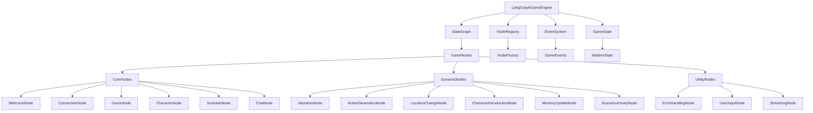

## State Management Dependencies

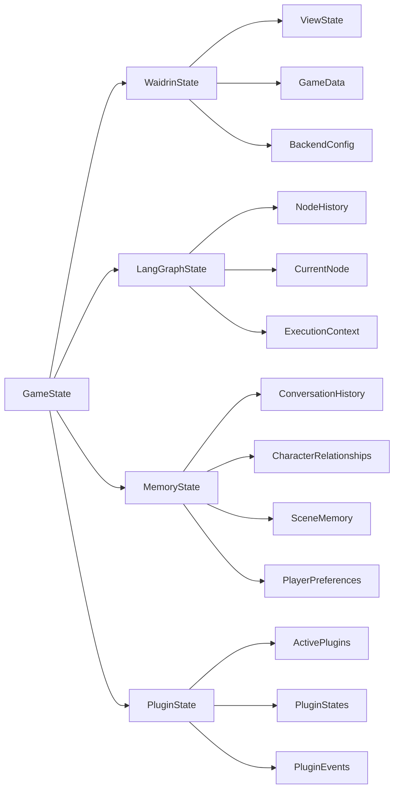

## Node Execution Flow

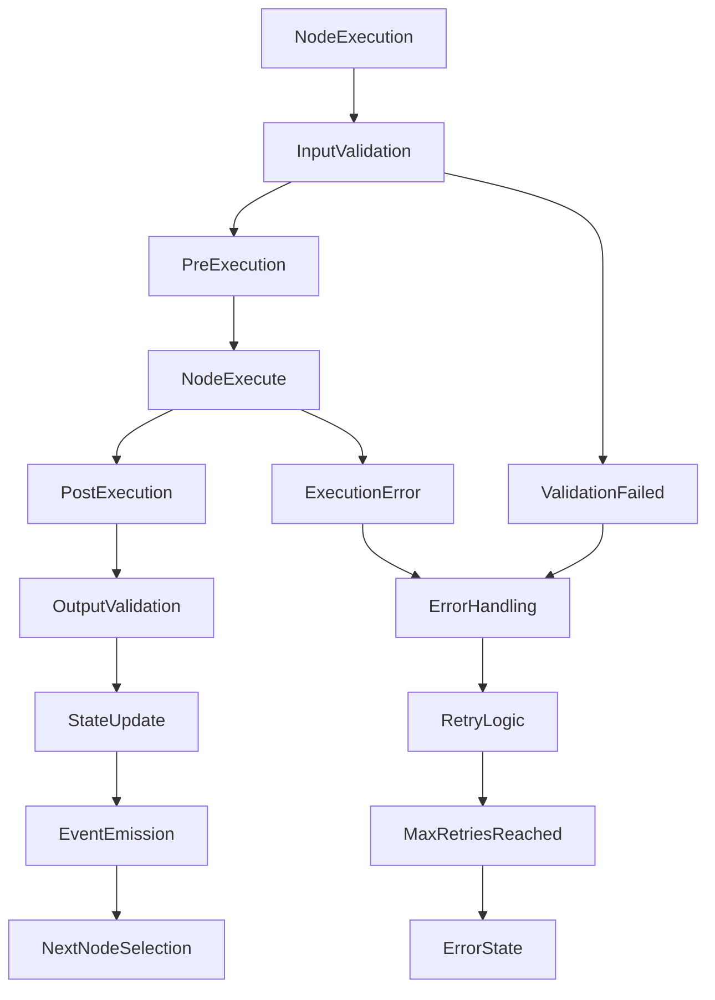

## Tool System Dependencies

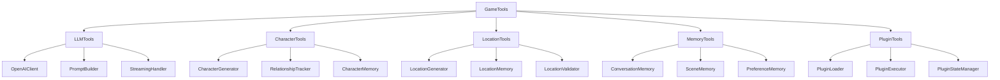

## Event System Dependencies

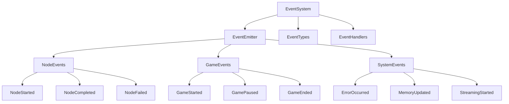

## Plugin System Dependencies

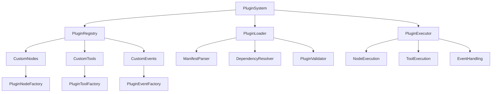

## Backend Integration Dependencies

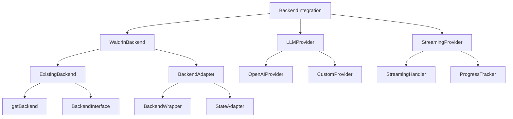

## Memory System Dependencies

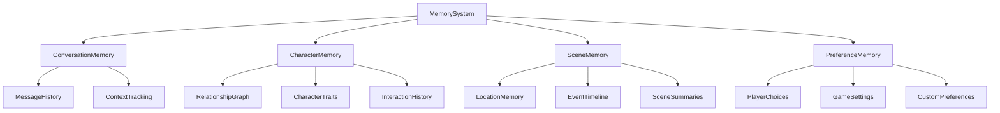

## Data Flow Dependencies

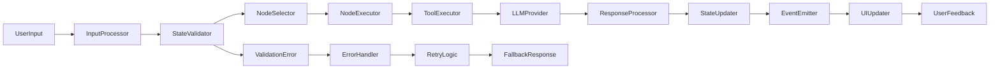

## Development Dependencies

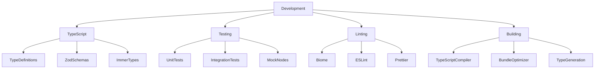

## External Dependencies

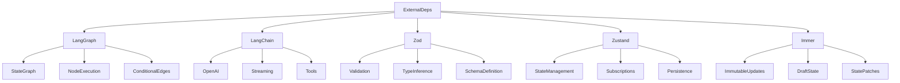

## Key Relationships

### 1. **Core Engine**
- `LangGraphGameEngine` is the central orchestrator
- Manages the state graph and node execution
- Handles events and error recovery

### 2. **Node System**
- All nodes implement the `GameNode` interface
- Nodes are registered through the `NodeRegistry`
- Execution is managed by the state graph

### 3. **State Management**
- `GameState` extends existing Waidrin state
- Uses Zustand + Immer for immutable updates
- Integrates with LangGraph state channels

### 4. **Tool System**
- Tools provide functionality to nodes
- LLM tools handle AI interactions
- Memory tools manage context and relationships

### 5. **Event System**
- Events provide real-time updates
- Used for UI updates and debugging
- Supports plugin integration

### 6. **Plugin System**
- Allows custom nodes and tools
- Integrates with the event system
- Maintains plugin state and lifecycle

This dependency graph shows how all components work together to create a flexible, extensible game engine that can handle complex narrative flows while maintaining compatibility with the existing Waidrin codebase.
